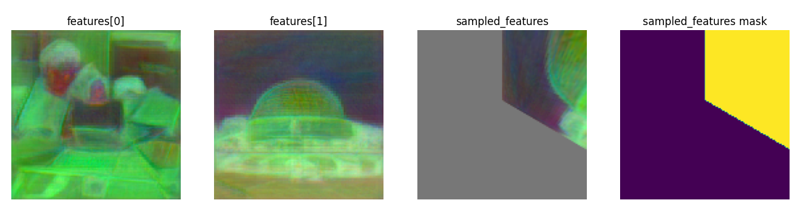
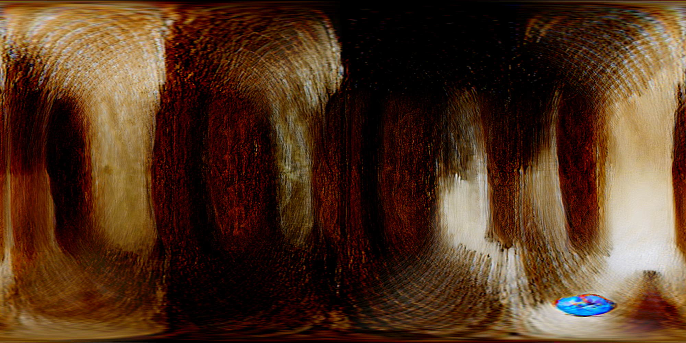
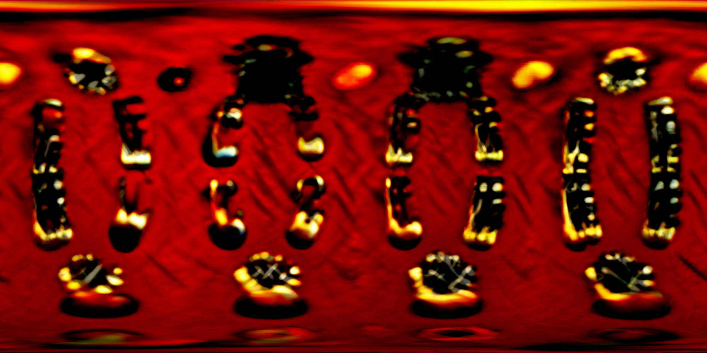
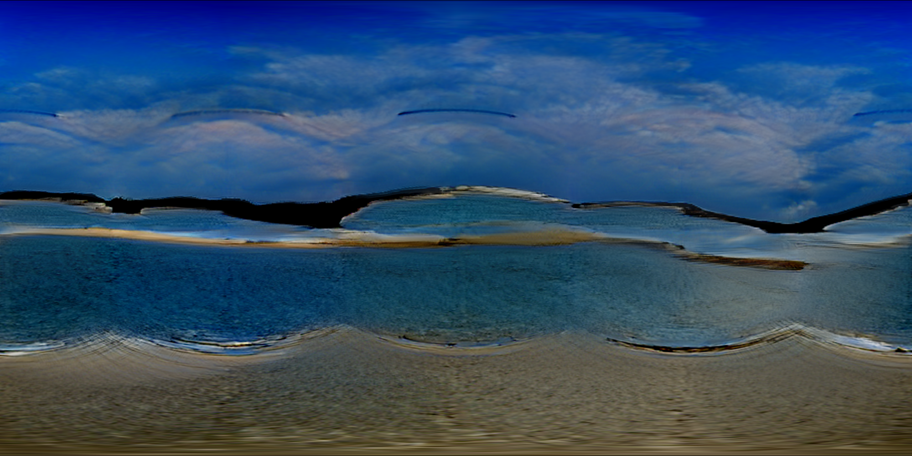
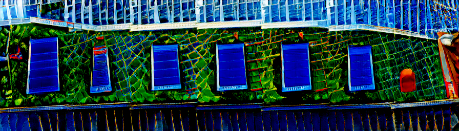
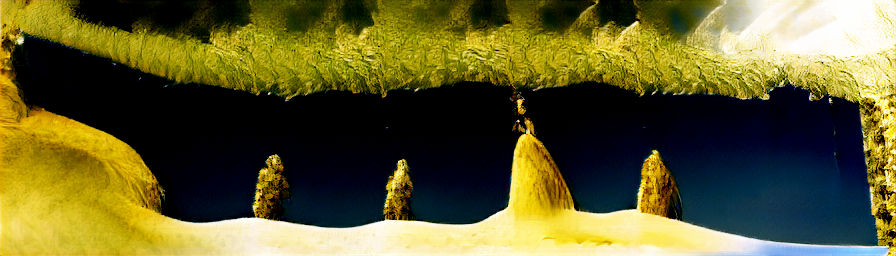
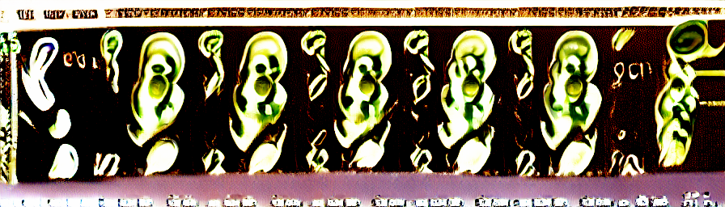
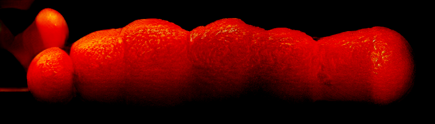

# Ganorama
<p align="center">
    
</p>

Zero-shot panorama / seamless sphere texture / large image generation with pre-trained GANs!

## About
This project uses BigGAN to generate seamless images on the surface of a sphere,
which can be viewed as panoramas or sphere textures. The results are saved as 
images via equirectangular projection (thanks to timy90022 for the implementation [here](https://github.com/timy90022/Perspective-and-Equirectangular)!).

There is also `bigimg.py`, which is a script for generating large (flat) images with a GAN.

<details> <summary>How it works!</summary>
This project is inspired by various (generally diffusion based) panorama generation papers,
such as MVDiffusion, which generate multiple overlapping images in parallel but enforce/encourage
consistency between them.

The method can be summarised as:
1. Create N camera poses, with some overlap, covering the entire surface of the sphere.
2. Begin generation of N arbitrary GAN images (as one batch), where each batch item corresponds to a camera pose.
3. For each *intermediate result* in the GAN network of shape (N x C x H x W),
   1. Project all features into 3D (using the corresponding camera poses)
   2. For each pair of features (i, j), project j's features into the local space of camera i
   3. Average each latent feature across all corresponding latent features in other views
4. Convert the views to an equirectangular image, using distance-based weighting to slightly smooth between the images.

<p align="center">
    
</p>
(Example image showing feature 1 being projected to feature 0's camera space, where it will be summed with existing features at the positions indicated by the mask. This is then repeated for every other feature overlapping with features[0].)


This operation, if applied at every intermediate stage, _guarantees_ multi-view consistency
between the N outputs (any point in 3D has identical features across all N generations, as each equals the average).
However, in practice, sharp lines show up where overlaps occur, so
I only apply the operation at some intermediate layers of the GAN, then apply some smoothing at the end.

I made this project for fun, but similar ideas applied to diffusion models
could be / have been successful for photorealism.
</details>

## Setup
```
git clone https://github.com/zzbuzzard/Ganorama
cd Ganorama
pip install -r requirements.txt
```
Additionally run `pip install open3d` if you wish to visualise the results as a point cloud
(optional, disabled by default)

## Usage
### Panorama Generation

Run `python main.py` to create several panoramas and save them to `out/panorama/[n].png`. Use `-n` to control the number of panoramas, `--z_mul` for fun abstract generations, `-o` to specify an output directory, and
`-m` to change the BigGAN model. See `python main.py -h` for full arguments.

For example,
```
python main.py -n 10 --z_mul 3
```
produces wacky results like these:
<p align="middle">
   
  
</p>
These look kinda cool when viewed from the outside as a
textured sphere (e.g. like the GIF at the top, where each sphere
is simply a Ganorama texture plus colour-based mesh displacement).


#### Specific Classes
You can pass specific ImageNet classes to `main.py` like so:
```
python main.py -n 2 --class_names="sandbar|valley" --no_share_z
```
Which gives a result similar to this:
<p align="center">
    
</p>
Ah. Just like being on holiday.

In general, the results will be very far from photorealism due to the limitations
of BigGAN, but also of course because of the simple zero-shot method.


### Big Image Generation
Using a very similar but simpler algorithm to panorama generation,
we can effectively stick GAN outputs together to create larger ones:
<div style="text-align:center">
    
</div>
<div style="text-align:center">
    
</div>
<div style="text-align:center">
    
</div>

Usage is similar to `main.py` e.g. high z_mul for results like above, or
```
python bigimg.py -n 4 --class_names="orange" --no_share_z --batch_size 6
```
produces a.. long orange:
<div style="text-align:center">
    
</div>

Note: `batch_size` controls the width of the image.

Note: currently only wide images are supported for bigimg.

Note: `no_share_z` should be passed if `class_names` are set, as otherwise all generations have the same `z` and `class` input.